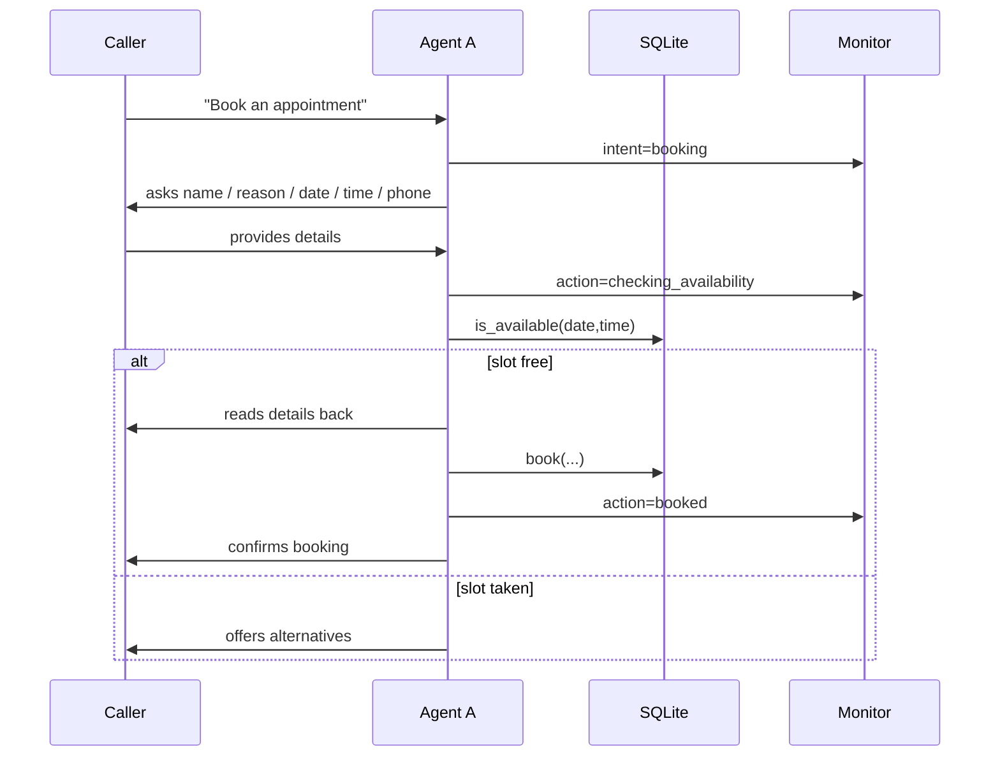
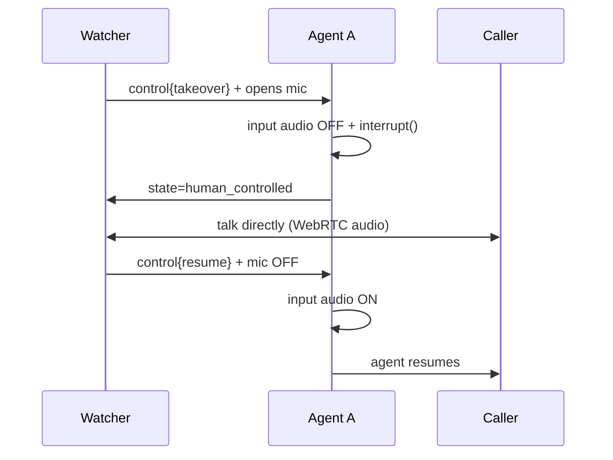
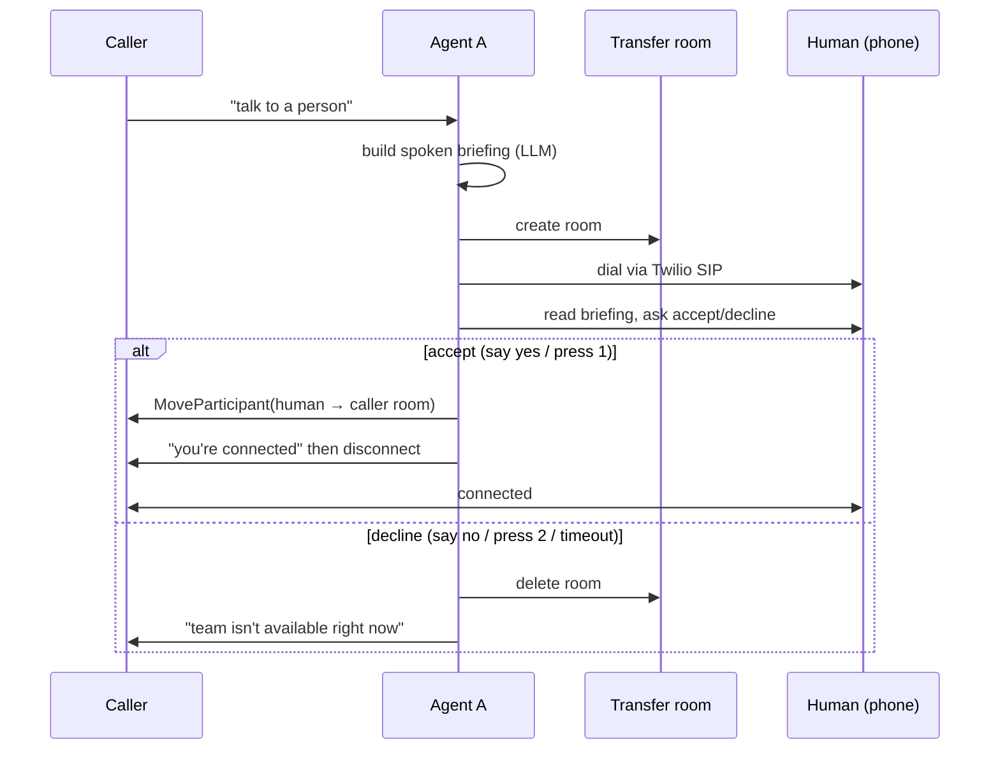

# Architecture & flows

## Components

- **LiveKit room** — the meeting point for the caller, the agent worker, and
  the watcher. Carries audio (WebRTC) and JSON events (data channel).
- **Agent worker** (`backend/`) — a LiveKit Agents `AgentSession` running
  Deepgram STT, OpenAI LLM (+ function tools), Deepgram TTS and Silero VAD.
- **Frontend** (`frontend/`) — Next.js app: a caller page and a monitor
  dashboard. Mints its own LiveKit tokens.
- **Twilio SIP trunk** — used only during a warm transfer to dial a real phone.

## Data-channel event protocol

Two topics on the LiveKit data channel:

| Topic | Direction | Messages |
|---|---|---|
| `monitor` | agent → watcher | `transcript`, `state`, `intent`, `action`, `status`, `summary` |
| `control` | watcher → agent | `{command: "takeover" \| "resume"}` |

Shapes are defined once in `backend/monitoring.py` and mirrored in
`frontend/lib/monitor-events.ts`.

## Booking flow

## Take-over flow

## Warm transfer flow

## End-of-call summary

When the caller participant disconnects (or the worker shuts down), the agent
calls the LLM with the full transcript + any booking, produces a structured
summary, publishes it on the `monitor` topic, and saves it to SQLite
(`summaries` table; readable via `GET /summary/{room}`).
